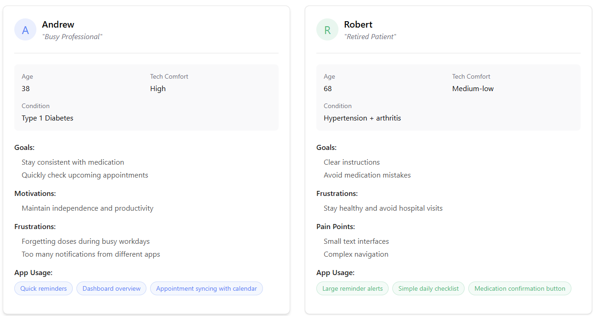
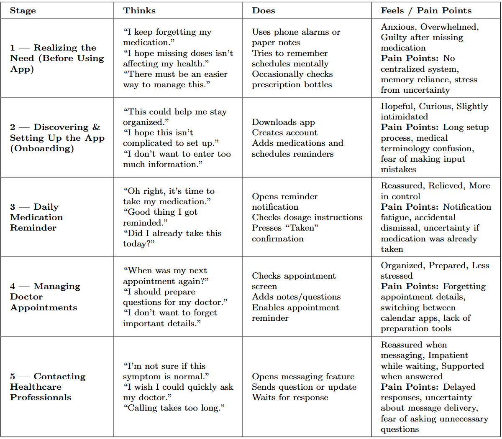
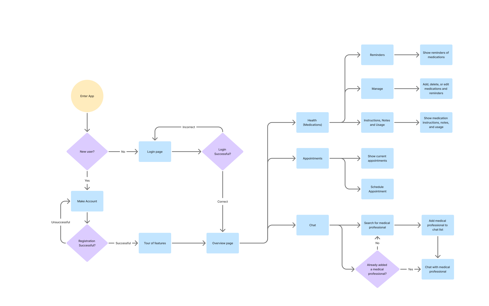
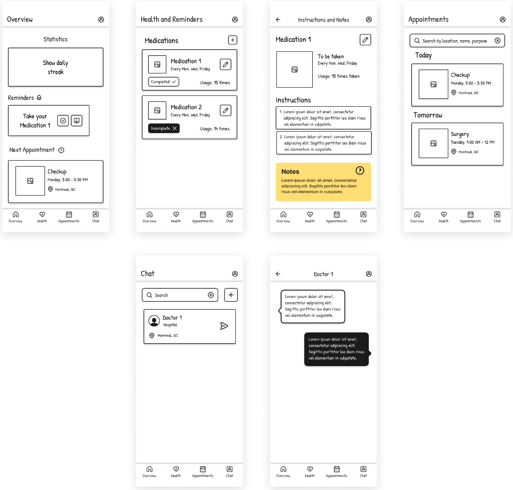
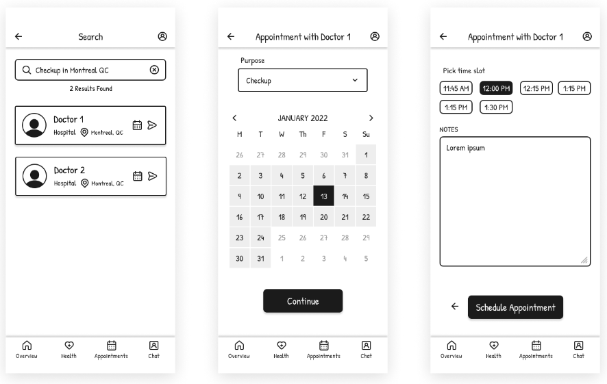
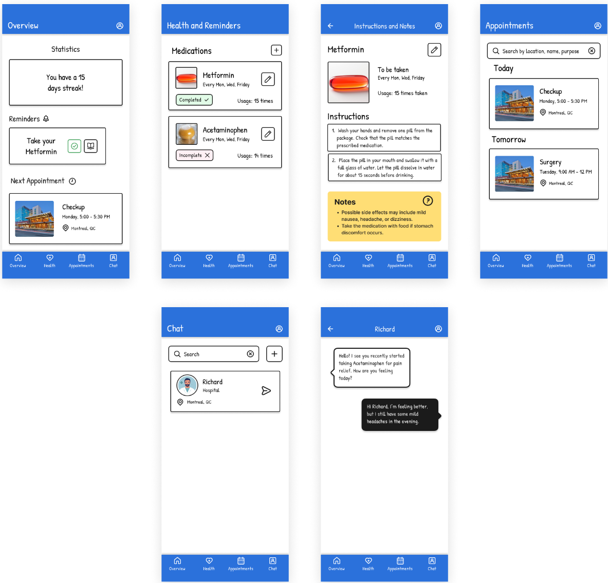
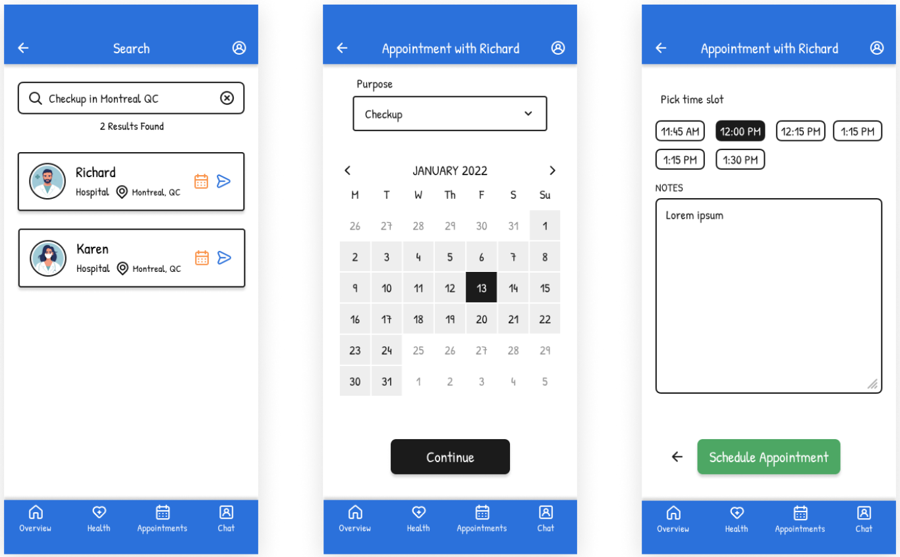

# TABLE OF CONTENTS

1. Introduction
2. User Research and Persona Creation
3. User Journey Mapping
4. Wireframing and Prototype Design
5. Usability Testing
6. Reflection
7. References

---

# 1. INTRODUCTION

The current blog focuses on the UX/UI design of a health companion app helping individuals with health management of their chronic health conditions. These health-related tasks include reminding users to take medications on time, scheduling doctor appointments, and contacting medical professionals. Although these tasks seem trivial individually, the demands of daily life can become overwhelming for individuals managing ongoing conditions. Often, this leads to missed medication deadlines or delayed medical follow-ups.

Research shows that mobile applications designed to support medication adherence produce positive outcomes, especially when reminders, interactive features, and healthcare data sharing are included. The proposed app aims to promote these outcomes by following a structured UX/UI design process.

The design process begins with user research and persona creation. A user journey map is then used to identify interaction steps and pain points. Low-fidelity wireframes and a prototype demonstrate functionality and navigation. A usability testing plan evaluates the design, followed by a reflection on challenges and lessons learned.

---

# 2. User Research and Persona Creation

To better understand daily medication-management challenges, research papers were reviewed with the following objectives:

- Understand why medication-management applications are needed
- Identify common causes of missed medication
- Learn what design features improve usability
- Understand how technology supports long-term health habits
- Explore communication needs between patients and healthcare providers

---

## Why Medication-Management Apps Are Needed

Research indicates that mobile health apps improve adherence among patients with chronic diseases through reminders, interactive features, and communication with healthcare professionals. Systematic reviews also show improved adherence compared to traditional care methods, supporting the need for digital tools that reduce mental effort in managing treatments.

---

## UX and Usability Findings

Usability studies reveal that users value simple interfaces and clear notifications. Reminder systems reduce stress and improve consistency. Additional evaluations highlight reminders, social support, and understandable medication information as key engagement factors.

---

## Chronic Disease Self-Management

Mobile health research shows that reminders and progress tracking help users build long-term habits. Educational content and provider communication were also found to significantly improve adherence.

---

## Appointments and Healthcare Communication

Appointment tracking and remote communication improve patient outcomes, provided systems remain simple and easy to use.

---

## Key Research Insights

Based on these reviewed papers, the key research insights are as follows:

- Reminder systems greatly improve adherence
- Users prefer simple interfaces
- Managing multiple prescriptions causes confusion
- Confirmation feedback reduces anxiety
- Easy healthcare communication is highly valued

---

## Personas

Two personas were created to represent different user groups.

Andrew is comfortable with technology and lives a fast-paced professional life. While he understands how to use apps efficiently, busy workdays often cause him to forget medications or delay health tasks. For Andrew, the app must be fast, unobtrusive, and reliable.

Bob represents users who are less comfortable with technology. He values clarity and reassurance over advanced features. Complex interfaces can quickly become barriers, so accessibility and simplicity are essential for his experience.

---

# 3. User Journey Mapping

<!-- TABLE CONVERTED TO IMAGE PLACEHOLDER -->

Users initially experience anxiety and uncertainty but gradually gain confidence as reminders and confirmations provide reassurance. These insights guided design decisions emphasizing simplicity and reduced cognitive effort.

---

# 4. Wireframing and Prototype Design

## User Flow Diagram

Inspired by the journey map, a user flow diagram was created showing the application's main navigation paths. The app focuses on four main screens:

- Overview
- Health
- Appointments
- Chat

---

## Wireframes

Wireframes were created to visualize layout and functionality before visual styling.

---

## Prototype

[A Figma prototype]{https://www.figma.com/proto/P3rEnWX7WJ3HDRZ9oP5UlJ/Paper-Wireframe-Kit--Community-?page-id=7585%3A17227&node-id=7585-17228&p=f&viewport=1189%2C763%2C0.86&t=zGJ9qs35PaOYojBj-1&scaling=scale-down&content-scaling=fixed&starting-point-node-id=7585%3A17228} was developed to better understand interaction flow.

---

## Choice of Style, Color, Animation, and Fonts

The interface design promotes clarity and comfort. A white background reduces visual distraction, while blue headers and footers create consistency and a trustworthy healthcare appearance.

Color feedback communicates status:

- Green indicates completed medication
- Red highlights missed or incomplete actions

Fonts used:

- **Patrick Hand** for primary interface text
- **Inter** for supporting elements

Subtle animations guide attention during navigation while avoiding cognitive overload.

---

# 5. Usability Testing

The usability testing focuses on:

- Validating ease of navigation
- Measuring reminder clarity
- Identifying usability issues

---

## User Tasks

Participants will:

- Add a new medication
- Confirm a reminder
- Schedule an appointment
- Send a message to a healthcare professional

---

## Data Collection

Methods include:

- Think-aloud testing
- Task completion timing
- Error and hesitation tracking
- Post-test questionnaires

---

## Expected Analysis Approach

Observations will be reviewed to identify recurring usability issues and prioritize improvements for future design iterations.

---

# 6. Reflection

The UX process revealed that users managing chronic conditions experience emotional stress and cognitive overload in addition to organizational challenges. Research and personas shifted the focus toward creating a reassuring and easy-to-use experience.

A major challenge involved balancing detailed medical information with simplicity for users of varying technological ability. This was addressed using simplified workflows and progressive disclosure. Overall, the UX process ensured decisions were grounded in real user needs, improving usability and accessibility.
